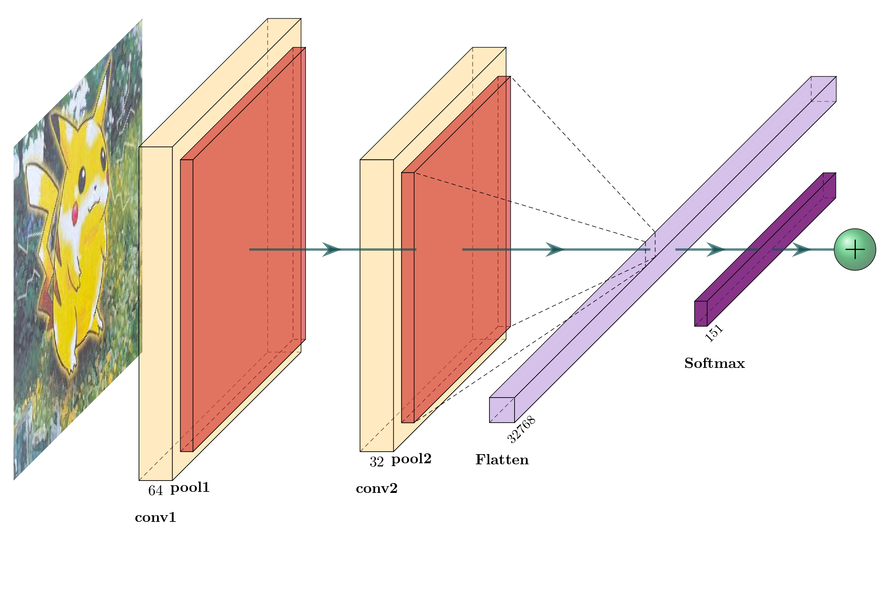

#Introduction
The program is designed to analyze pictures of Pokémon TCG 1st generation cards. It aims to analyze the tradeoff between combinations of activation functions and optimizers, emphasizing the importance of well-performing variants in a pure, CNN-based image classification task. For more details, see the paper.

